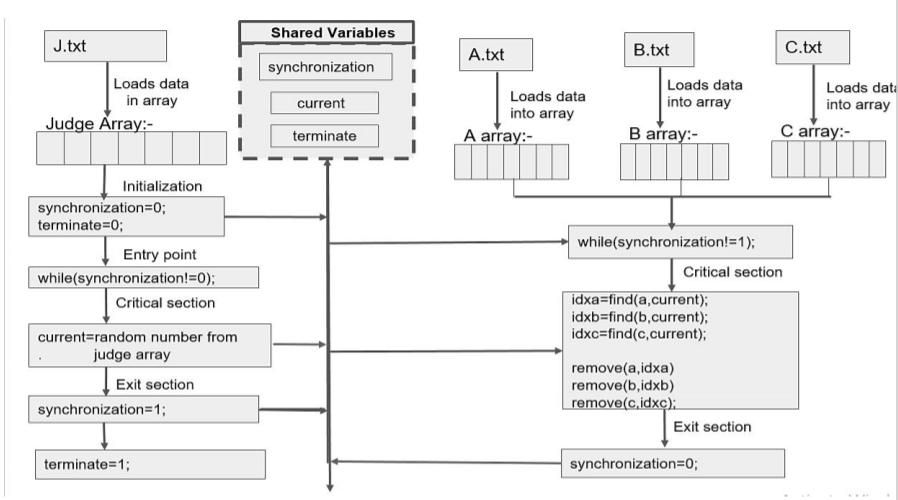

# Housy-Game

## Problem Statement

### Pizza-Problem (Using shared memory synchronization with busy-waiting)

#### Introduction
Three persons A, B, and C attend a game of housy whose prize is a jumbo pizza. The person whose coupon gets
exhausted first gets first access to the pizza. The second person whose coupon gets exhausted gets second access
and finally the third.
If multiple coupons of persons get exhausted simultaneously, then those persons can access the pizza in any arbitrary
order between them.

#### Game begins
The three persons enter the room where the housy game is being held, with their respective
coupons. The judge J starts calling out numbers one by one. After a number is called out, the three persons up date
their coupons by marking the number just called out. Only after the three persons have finished updating their
coupons ,does the judge call out the next number. If all the numbers in the coupon for a person get marked, he goes
ahead to have his share of pizza. The order of access to pizza must be strictly maintained.

#### Question
Write code for the processes A,B,C and J? The coupons are to be modelled as files containing lists of numbers. The
numbers (between 1 to 100) are generated by J from a fixed test file , and the coupons contain 5 numbers each.
There quired synchronization must be performed using shared variables[Linux Shared Memory] with atomic reads
and writes .The solution must be devoid of unnecessary-delays, and starvation.
Don't Use semaphores. Only Shared Memory Must be Used.

### Solutions : - 

#### Basic Structure

#### Code Structure

